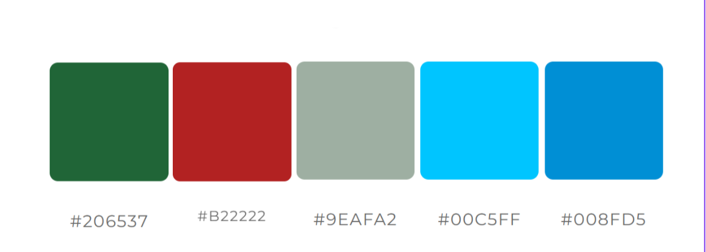
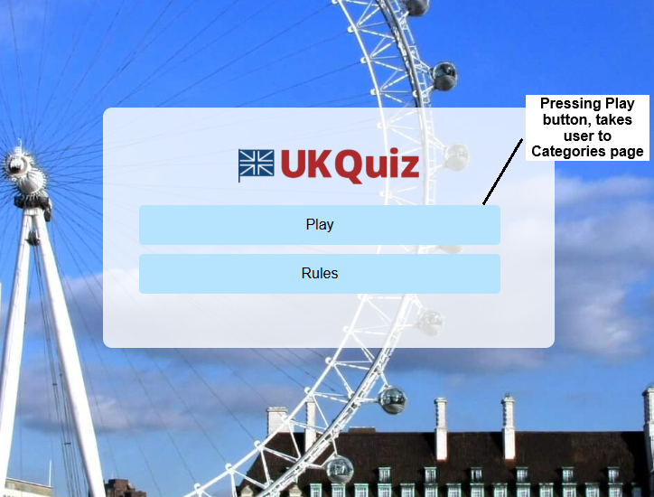
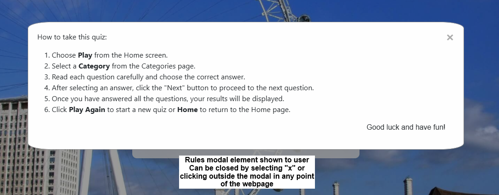

# JavaScript Group Hackathon Project <a id="top"/>

## Introduction
The UK Quiz has been designed and implemented by our team of three as part of Hackathon 1 for the Code Institute's 16-week AI-Augmented Full Stack Development Bootstrap course. 
Live site: [https://carlos-n21.github.io/UK-Quiz/](https://carlos-n21.github.io/UK-Quiz/)

## Table of Contents
- [User Experience Design](#user-experience-design)
- [Project Brief](#project-brief)
- [Users](#users)
- [Project Plan](#project-plan)
- [User Stories](#user-stories)
- [Wireframes](#wireframes)
- [Design](#design)
    - [Colour Scheme](#colour-scheme)
    - [Typography](#typography)
    - [Imagery](#imagery)
- [Website Features](#website-features)
    - [Footer](#footer)
- [Responsive Design](#responsive-design)
- [Future Features](#future-features)
- [Technologies Used](#technologies-used)
- [Deployment](#deployment)
- [Testing](#testing)
- [Credits](#credits)

[Back to top](#top)

## User Experience Design
A user-centred approach has been taken through the inception, design and development of this site.

### Project Brief
The project goal is to provide a tool for users that wish to be UK citizens, which involves taking a quiz about Life in the UK as part of their assessment to get citizenship.

The site user's goals are to provide a short quiz for new arrivals to the UK to prepare for the "Life in the UK" Citizenship exam, by providing different categories for the user to test their knowledge and practice for the formal test, giving users useful feedback throughout the quiz on their answers and giving them a score at the end of each quiz. We envisage this site to be a quick and efficient way for the user to test their knowledge on the go or during a short break.

### Users
In order to fully understand our users' needs, we asked Microsoft Co-pilot to draw up some user personas based on our project brief. We refined the prompts and after three tries and some refinement afterwards, here are the personas we used:
- Persona 1: "Sophie – The Student" 
Sophie Li, 24 years old, international university student that recently finished her degree in the UK. Needs to pass the Life in the UK test to be able to stay and work in the UK. 
Looking to find an engaging and interactive way to study for the citizenship test whilst balancing study with her academic workload, in an effective way, which can be hard to do and also trying to avoid burnout. 
Likes to a modern, interactive tool that make learning fun. Very comfortable using new technologies, using mostly her mobile and the laptop to study. 
Would like a mobile-friendly design that can be used on the go, that feels less like a shore and more like a fun moment. 
Wishes to do the quiz and practice for the test between classes and her study breaks.

- Persona 2: "Ali – The Busy Professional" 
Ali Ahmed, 40 years, IT Manager, has been living in the UK for 5 years and needs to pass the Life in the UK test to apply for British citizenship. 
Aims to efficiently prepare for the test alongside a busy work schedule. 
Wants to find resources that look straightforward and time-efficient, so that he can practice for the test. 
Has no problems using different technologies to study and prefers to do this on his tablet during his commute or at home on the desktop. 
Finds it difficult to find a high-quality, time-efficient study tool that can be adapted to his work schedule and family time, whilst keeping him motivated. 
Wants to use a clean, professional interface with minimal distractions, that can be time-efficient and completed quickly, also providing a summarized feedback and analysis of the performance during the quiz.

- Persona 3: "Emma – The New Immigrant" 
Emma Johnson, 32 years old, Healthcare Assistant, recently moved to the UK from Australia. Is settling in and needs to pass the Life in the UK test to get her indefinite leave to remain. 
Comfortable using new technologies to study and prefers to use the smartphone or laptop to search and study, mostly during her breaks at work and in the evenings. 
Hopes to find reliable resources to study for the Life in the UK test, like quizzes that she can use to practice for the actual exam. Wants a user-friendly layout with clear and concise information for each answer. 
And, if possible, track her progress and identify areas where she needs to study more. 
She's looking for an app that can show diverse, engaging and reliable information. 
Also needs to get feedback about her choices for each question, if right/wrong, allowing her to do further research when the answer is wrong. 
Wishes to be able to test her knowledge in different areas/subjects of the Life in the UK.

## Project Plan
On the planning day, the draft user stories were derived with the help of MS Co-pilot, which provided a sufficient and relevant user stories including the acceptance criteria and tasks required for each user story. Some adjustments had to be made, as the scope of some of the user stories didn't fit into the project timeframe, and we were limited to using the technologies we have learnt so far on the course so we couldn't include any requirements that needed a database backend.

### User Stories
(Placeholde table, needs to be replaced with final user stories)
| Tables        | Are           | Cool  |
| ------------- |:-------------:| -----:|
| col 3 is      | right-aligned | $1600 |
| col 2 is      | centered      |   $12 |
| zebra stripes | are neat      |    $1 |

This is our [Kanban Project Board](https://github.com/users/Carlos-n21/projects/12/views/1?visibleFields=%5B%22Title%22%2C%22Assignees%22%2C%22Status%22%2C%22Labels%22%5D) on GitHub repo

### Wireframes

- Mobile view:
  
  
- Tablet view:
  
  
- Desktop/Laptop view:
  

[Back to top](#top)

## Design
### Colour Scheme
- Color palette used 
  

- Contrast check for correct and incorrect answer on quiz 
   

### Typography

### Imagery
- Background image 
  

## Website Features
- Homepage
  

  

- Rules - modal
  

- Categories
  

  

- Quiz page
  

- Results
  

[Back to top](#top)

## Responsive Design
Most of the content is responsive to different screen sizes as it was built using components from the Bootstrap Library.

[Back to top](#top)

## Future Features
Timer
Progress Indicator

[Back to top](#top)

## Technologies Used
### Languages and Technologies

### Libraries

### Tools and Programs

[Back to top](#top)

## Deployment

The process is as follows:
1. Login to your GitHub profile.
2. Go to the [Code Institute Template](https://github.com/Code-Institute-Org/ci-full-template).
3. Click **Use this template** and then **Create a new repository**.
4. Enter the repo name and choose to create from template
5. Click **Open** with the Gitpod logo to open the Code Institute IDE workspace.
6. Open VS Code locally and click on Gitpod logo on the left. Click on right arrow next to the workspace you want to work on.
 
Once the MVP has been created in Gitpod, go to GitHub Pages to make an early deployment of the project, so that testing can be done in Dev Tools to highlight key issues that need to be resolve early on in the project.

[Back to top](#top)

## Testing
Validation of HTML/CSS, Lighthouse Audits, Bugs

#### HTML Validation
- Used [W3C Markup Validation Service](https://validator.w3.org/#validate_by_input) to test the HTML on all webpages and updated as needed.

#### CSS Validation
- Used [W3C CSS Validation Service](https://jigsaw.w3.org/css-validator/#validate_by_input) to test CSS style and no errors found.

#### Lighthouse Audit

### Bugs yet to be Fixed
- 

[Back to top](#top)

## Credits
### Code References
Many of the features were based on/inspired by examples in the [Code Institute Bootcamp LMS](https://learn.codeinstitute.net/dashboard) on the use of HTML, CSS and Javascript.

### Content References
MS Copilot was used to generate some of the quiz questions and feedback content, which the team then reviewed and edited before including into the site.
Copilot was used to help coding HTML, CSS style and JavaScript code as can be seen with the prompts below:

- "Can you help me update the current code, so that the page shows this image: assets/images/london-eye-wide-2.jpg, on the background? Also can you help create a container on the middle of the page with a text box with the text "Life in the UK" close to the top of the container and two buttons "Play" after the text and "Rules" below the previous button?"

- "Can you help change the image style of ".container h1" background to a fadding style that highlights the title?"

- "can you help update the code so that the image is small and shows between the p element and the "Play Again" button?"

- "Can you update the code to show categories buttons on top of each other on a mobile screen with space between them? And 2 on top and 2 above them with space between them? Categories buttons need to be light-blue with black text, all with same dimensions, please."

### Media References
[Pexels.com](https://www.pexels.com/) for some of the images used in the quiz questions
The UK Quiz logo was generated using [Logo.ai](https://www.logoai.com/logo-maker). The logo and the photos have been edited and optimised using [Squoosh](https://squoosh.app/) or other similar applications.
Background image TBC
[GIPHY](https://giphy.com/) for the animated gifs on the results page

#### Acknowledgements
Everyone in our WECA group who have been so helpful and supportive leading up to this group project, and
Code Institute tutors (Dillon, Mark and Roo) for answering our questions

[Back to top](#top)
