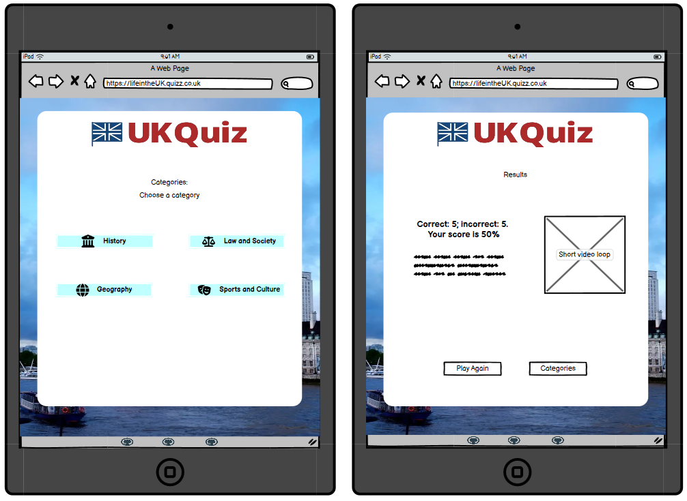
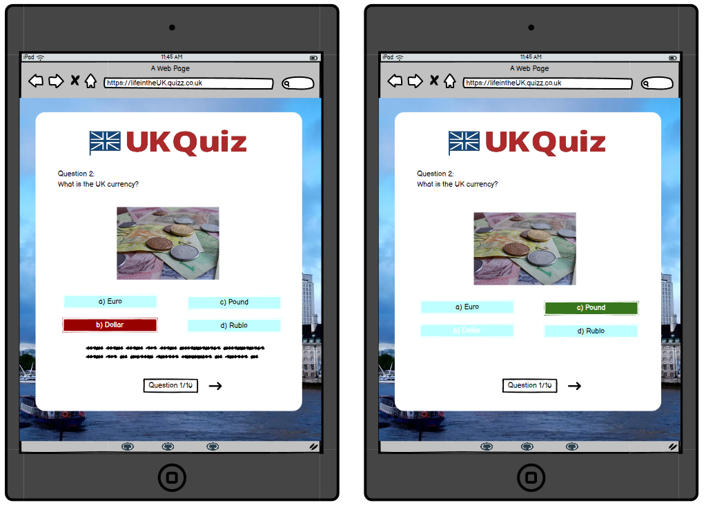
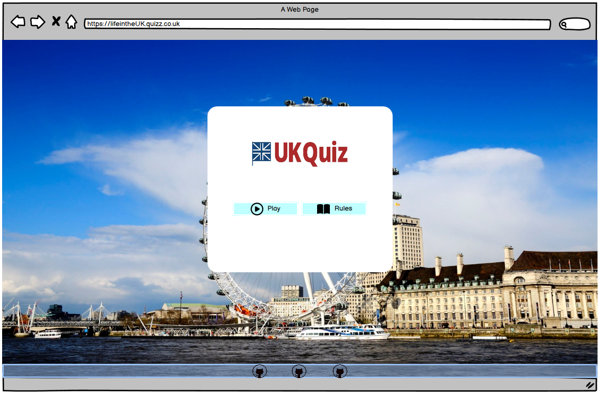
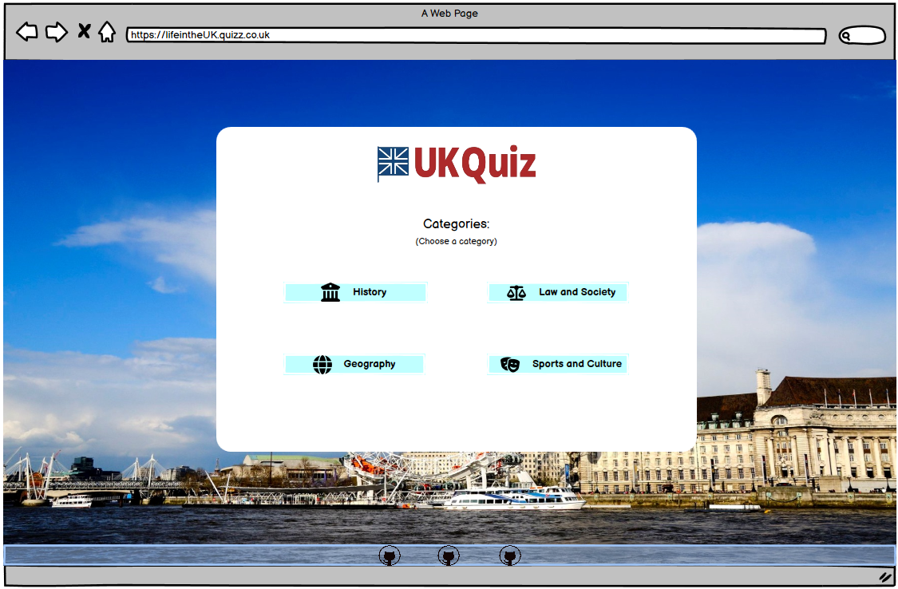
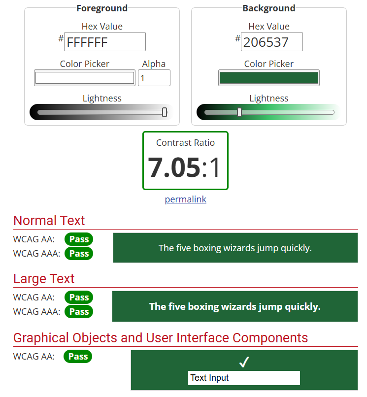

# JavaScript Group Hackathon Project <a id="top"/>

## Introduction
The UK Quiz has been designed and implemented by our team of three as part of Hackathon 1 for the Code Institute's 16-week AI-Augmented Full Stack Development Bootstrap course. 
Live site: [https://carlos-n21.github.io/UK-Quiz/](https://carlos-n21.github.io/UK-Quiz/)

## Table of Contents
- [User Experience Design](#user-experience-design)
- [Project Brief](#project-brief)
- [Users](#users)
- [Project Plan](#project-plan)
- [User Stories](#user-stories)
- [Wireframes](#wireframes)
- [Design](#design)
    - [Colour Scheme](#colour-scheme)
    - [Typography](#typography)
    - [Imagery](#imagery)
- [Website Features](#website-features)
    - [Homepage](#homepage)
    - [Rules modal](#rules-modal)
    - [Categories Page](#categories-page)
    - [Quiz Page](#quiz-page)
    - [Results Page](#results-page)
    - [Single Javascript Makes Multiple Pages](#single-javascript-makes-multiple-pages)
    - [Question Bank](#question-bank)
    - [Footer](#footer)
- [Responsive Design](#responsive-design)
- [Future Features](#future-features)
- [Technologies Used](#technologies-used)
- [Deployment](#deployment)
- [Testing](#testing)
- [Credits](#credits)
    - [Code References](code-references)
    - [Use of AI](use-of-ai)
    - [Content References](content-references)
    - [Media References](media-references)
    - [Acknowledgements](acknowledgements)

[Back to top](#top)

## User Experience Design
A user-centred approach has been taken through the inception, design and development of this site.

### Project Brief
The project goal is to provide a tool for users that wish to be UK citizens, which involves taking a quiz about Life in the UK as part of their assessment to get citizenship.

The site user's goals are to provide a short quiz for new arrivals to the UK to prepare for the "Life in the UK" Citizenship exam, by providing different categories for the user to test their knowledge and practice for the formal test, giving users useful feedback throughout the quiz on their answers and giving them a score at the end of each quiz. We envisage this site to be a quick and efficient way for the user to test their knowledge on the go or during a short break.

### Users
In order to fully understand our users' needs, we asked Microsoft Co-pilot to draw up some user personas based on our project brief. We refined the prompts and after three tries and some refinement afterwards, here are the personas we used:
- Persona 1: "Sophie – The Student" 
Sophie Li, 24 years old, international university student that recently finished her degree in the UK. Needs to pass the Life in the UK test to be able to stay and work in the UK. 
Looking to find an engaging and interactive way to study for the citizenship test whilst balancing study with her academic workload, in an effective way, which can be hard to do and also trying to avoid burnout. 
Likes to a modern, interactive tool that make learning fun. Very comfortable using new technologies, using mostly her mobile and the laptop to study. 
Would like a mobile-friendly design that can be used on the go, that feels less like a shore and more like a fun moment. 
Wishes to do the quiz and practice for the test between classes and her study breaks.

- Persona 2: "Ali – The Busy Professional" 
Ali Ahmed, 40 years, IT Manager, has been living in the UK for 5 years and needs to pass the Life in the UK test to apply for British citizenship. 
Aims to efficiently prepare for the test alongside a busy work schedule. 
Wants to find resources that look straightforward and time-efficient, so that he can practice for the test. 
Has no problems using different technologies to study and prefers to do this on his tablet during his commute or at home on the desktop. 
Finds it difficult to find a high-quality, time-efficient study tool that can be adapted to his work schedule and family time, whilst keeping him motivated. 
Wants to use a clean, professional interface with minimal distractions, that can be time-efficient and completed quickly, also providing a summarized feedback and analysis of the performance during the quiz.

- Persona 3: "Emma – The New Immigrant" 
Emma Johnson, 32 years old, Healthcare Assistant, recently moved to the UK from Australia. Is settling in and needs to pass the Life in the UK test to get her indefinite leave to remain. 
Comfortable using new technologies to study and prefers to use the smartphone or laptop to search and study, mostly during her breaks at work and in the evenings. 
Hopes to find reliable resources to study for the Life in the UK test, like quizzes that she can use to practice for the actual exam. Wants a user-friendly layout with clear and concise information for each answer. 
And, if possible, track her progress and identify areas where she needs to study more. 
She's looking for an app that can show diverse, engaging and reliable information. 
Also needs to get feedback about her choices for each question, if right/wrong, allowing her to do further research when the answer is wrong. 
Wishes to be able to test her knowledge in different areas/subjects of the Life in the UK.

## Project Plan
On the planning day, the draft user stories were derived with the help of MS Co-pilot, which provided a sufficient and relevant user stories including the acceptance criteria and tasks required for each user story. Some adjustments had to be made, as the scope of some of the user stories didn't fit into the project timeframe, and we were limited to using the technologies we have learnt so far on the course so we couldn't include any requirements that needed a database backend.

### User Stories
Here are all the user stories that have been prioritised (all must have and some should have ones) for the current implementation of the site:
| User Stories                                    | MoSCoW priority           |  Status |
| ----------------------------------------------- |:-------------------------:| -------:|
| Homepage                                        | must have                 |   Done  |
| Choose Quiz by Category                         | must have                 |   Done  |
| Show Quiz Question                              | must have                 |   Done  |
| Score Calculation                               | must have                 |   Done  |
| Responsive Design                               | must have                 |   Done  |
| Mark Answers and Give Feedback                  | must have                 |   Done  |
| Show Score and Results                          | must have                 |   Done  |
| Accessibility Features                          | must have                 |   Done  |
| Icons, logos and favicon                        | must have                 |   Done  |
| Rules Modal                                     | should have               |   Done  |
| Progress Indicator                              | should have               |   Done  |
| Random Question                                 | should have               |   Done  |

All user stories were logged on the [Kanban Project Board](https://github.com/users/Carlos-n21/projects/12/views/1?visibleFields=%5B%22Title%22%2C%22Assignees%22%2C%22Status%22%2C%22Labels%22%5D) on GitHub repo, along with the assessment criteria and expected performance for the Hackathon, which were also prioritised as must-have.

As well as using the Project Board to track progress on our project, we also used it during testing to log any significant bugs that need to be fixed before the project deadline. These were then assigned and prioritised alongside other issues and user stories.

[Back to top](#top)

### Wireframes
Initial layout of website:

- Mobile view: 
  
  
  
- Tablet view: 
    
  
- Desktop/Laptop view: 
    

[Back to top](#top)

## Design
### Colour Scheme
We took inspiration from the Union Jack and websites associated with the British identity, such as [official site for the Royal Family](https://www.royal.uk/). We also used prompts in Co-pilot and ChatGPT which recommended the following colours:

Based on these suggestions and using [Colorspace Color Palette Generator](https://mycolor.space/?hex=%2300247D&sub=1), we decided to use the following palettes: 

- Contrast check for correct and incorrect answer on quiz 
   

### Typography
Initial website font-family was Times New Roman, which was changed to "Arial, open sans" for better reading, showing smoother lines.
Not imported from Google Fonts, used as suggestion from COpilot whilst coding on style.css

### Imagery
- Background image 
  

[Back to top](#top)

## Website Features
### Homepage
  

The Homepage has 2 buttons, "Play" that takes the user to the Categories page.
And Rules, which will open the modal explaining hot to play/do the quiz.

### Rules modal
  

This modal shows how to use the site and can be closed by clicking/selecting the "x" on the top-right side of the modal or clicking/selecting any area of the webpage outside the modal area.

### Footer
  

The footer contains 3 GitHUb icons for each of the members of the group, that can be accessed by clicking/selecting each of them. Will open a new page for the GitHub account.

### Categories Page
  

The categories menu consists of 4 buttons to each of the 4 categories of quiz questions. A Font Awesome icon has been added to each button to help users identify the categories more easily. By clicking on the category button, users are taken to the Quiz.
If a user needs to go back to the homepage, he/she can select/click on the title to be redirected.

### Quiz Page
  

One question is displayed on the chosen category at a time, and users must choose one of the answer options before the Next button appears to take them to the next question. They can only attempt each question once in each round.
 
### Results Page
At the end of the round, which is currently set to 10 questions, users are given their scores: the total number of correct and incorrect answers they got, as well as the score as a percentage. In the actual Life in the UK exam, users are required to answer 24 questions and get at least 18 in order to pass, so the pass rate is 75%. By providing the score in this format, users can track their performance and focus on their weaker areas where necessary.

### Single Javascript Makes Multiple Pages
These three UI were initially built in HTML using CSS and Bootstrap Grids. The main javascript file script.js contains an event listener for the page load, and the content loaded is determined based on the ID in the body tag of the Categories and Quiz pages.

  

### External Question Bank
Since there is currently no publicly available API to the Life in the UK test questions, we decided to use a question bank in our project. We implemented this as an additional Javascript file which contains 4 arrays of question Objects, one for each category. These are exported and imported into the main javascript file using ES6 version import/export.

[Back to top](#top)

## Responsive Design
Most of the content is responsive to different screen sizes as it was built using components from the Bootstrap Library.

## Future Features
- Timer: will help user to know how fast he/she is taking to do the test and be able to reflect if needing to be quicker with the quizz or  if can take more time to read and think about the answers. THe official test is timed, so the user needs to have this in account to avoid not having enough time to finish it.
- Progress Indicator: will help the user to monitor his progress from the initial attempts to a level where the user remembers/recalls the information about different categories or questions faster and able to take less time to do the quiz, getting the knowledge more consolidated and therefore, being better prepared to do the oficial quiz.

## Technologies Used
### Languages and Technologies

### Libraries

### Tools and Programs

[Back to top](#top)

## Deployment

The process is as follows:
1. Login to your GitHub profile.
2. Go to the [Code Institute Template](https://github.com/Code-Institute-Org/ci-full-template).
3. Click **Use this template** and then **Create a new repository**.
4. Enter the repo name and choose to create from template
5. Click **Open** with the Gitpod logo to open the Code Institute IDE workspace.
6. Open VS Code locally and click on Gitpod logo on the left. Click on right arrow next to the workspace you want to work on.
 
Once the MVP has been created in Gitpod, go to GitHub Pages to make an early deployment of the project, so that testing can be done in Dev Tools to highlight key issues that need to be resolve early on in the project.

[Back to top](#top)

## Testing
Validation of HTML/CSS, Lighthouse Audits, Bugs

### HTML Validation
- Used [W3C Markup Validation Service](https://validator.w3.org/#validate_by_input) to test the HTML on all webpages and updated as needed.

### CSS Validation

- Used [W3C CSS Validation Service](https://jigsaw.w3.org/css-validator/#validate_by_input) to test CSS style and no errors found.

### Lighthouse Audit

### JSHint Linter

- Used [JS Hint](https://jshint.com/)) to test Javascript for ES version 6 and got no warnings. 
script.js
 
questionbank.js

### Bugs yet to be Fixed
- Some buttons like the "Play Again" button with different shape on the results.
- Footer and icons showing well on Chrome browser but not showing the full icons logo on Firefox.
- Home button had to be taken off, has format/style changing in different pages (eg: categories and results")

[Back to top](#top)

## Credits
### Code References
Many of the features were based on/inspired by examples in the [Code Institute Bootcamp LMS](https://learn.codeinstitute.net/dashboard) on the use of HTML, CSS and Javascript.
 
Other resources used as reference for the implementation: 
[How to add Icons to Buttons in Bootstrap 5 ?](https://www.geeksforgeeks.org/how-to-add-icons-to-buttons-in-bootstrap-5/) 
[Two Pages One Script](https://youtu.be/7_kaX07tVFc?si=SwNk5z7PHlPhtt9S) by [SteveGriffith-Prof3ssorSt3v3](https://www.youtube.com/@SteveGriffith-Prof3ssorSt3v3)

### Use of AI
#### Code Generation
The GitHub Copilot extension was installed in our local versions of Visual Studio Code. We were therefore able to write prompts or highlight functions in pseudocode and ask Copilot to suggest code snippets. Suggestions needed to be reviewed before they were included, as occassionally code may refer to e.g. variables that have not been declared or filepaths that do not exist. Copilot was also able to suggest higher-level implementation ideas when asked for ways to pass data between pages, and suggested reading on the use of local storage.

Also used to generate some of the quiz questions and feedback content, which the team then reviewed and edited before including into the site.
Copilot was used to help coding HTML, CSS style and JavaScript code as can be seen with the prompts below:

- "Can you help me update the current code, so that the page shows this image: assets/images/london-eye-wide-2.jpg, on the background? Also can you help create a container on the middle of the page with a text box with the text "Life in the UK" close to the top of the container and two buttons "Play" after the text and "Rules" below the previous button?"

- "Can you help change the image style of ".container h1" background to a fadding style that highlights the title?"

- "can you help update the code so that the image is small and shows between the p element and the "Play Again" button?"

- "Can you update the code to show categories buttons on top of each other on a mobile screen with space between them? And 2 on top and 2 above them with space between them? Categories buttons need to be light-blue with black text, all with same dimensions, please."

#### Debugging
Copilot was regularly used for debugging code using the inline editor. When using Chrome DevTools to inspect the preview or deployed pages, Chrome DevTools AI Assistance panel was also used to explain the errors raised in the Console.

#### Code Optimisation
When coding more complicated logical constructs, e.g. a complex iteration to loop through an array to generate innerHTML elements in a Bootstrap grid, the basic structure of the grid without the loop was assigned to the innerHTML of the target element. Once tested to run correctly, Copilot was prompted to optimise on the code. It suggested using a map method to loop through the options array to build the HTML for each element, and join them all together as a string. Again, this needed to be tested fully before it was incorporated into the code. Running the resultant code produces the same result as before. 

#### Impact on Workflow
On the whole, it has been useful to pair programme with Copilot and use it for debugging and testing as we code. Due to the tight timescale of the hackathon, the team tried to use AI wherever possible to reduce development time, from creating user stories to suggesting commit messages. It was also able to explain selected code written by other team members with a concise and accurate summary. Occassionally it can be annoying when Copilot suggests code in ghost text unnecessarily, or introduces additional closing tags or brackets unnecessarily. Nonetheless, when used with specific prompts and context, some of the results provided by Copilot have been mostly usable, thus speeding up development. 

### Content References

### Media References
[Pexels.com](https://www.pexels.com/) for some of the images used in the quiz questions 
Microsoft Copilot was used to generate some of the illustrations for the quiz questions 
The UK Quiz logo was generated using [Logo.ai](https://www.logoai.com/logo-maker). The logo and the photos have been edited and optimised using [Squoosh](https://squoosh.app/) or other similar applications. 
Background image TBC
[GIPHY](https://giphy.com/) for the animated gifs on the results page
Background image: https://pixabay.com/photos/london-eye-london-city-england-351203/

### Acknowledgements
Everyone in our WECA group who have been so helpful and supportive leading up to this group project, and
Code Institute tutors (Dillon, Mark and Roo) for answering our questions

[Back to top](#top)
